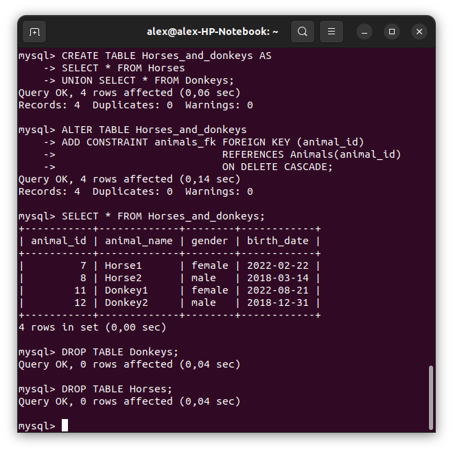
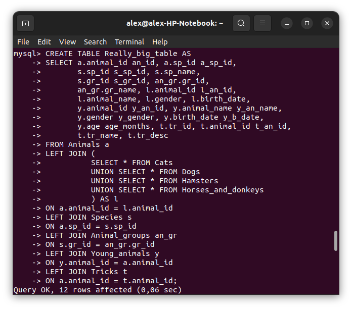

## Информация о проекте

---

&nbsp;&nbsp;&nbsp;&nbsp;В данном проекте содержится программа, имитирующая работу
реестра домашних животных, dump-файлы базы данных,
соответствующие состоянию последней до и после
исполнения операций, описанных в заданиях 10-12,
а также классовая диаграмма, описывающая
взаимосвязь между классами, содержащимися в пакете
species.

### Содержание:
* [Задания 1 - 5](#задания-1---5)
* [Задание 6](#задание-6)
* [Задания 7 - 9](#задания-7-9)
* [Задание 10](#задание-10)
* [Задание 11](#задание-11)
* [Задание 12](#задание-12)
* [Задание 13](#задание-13)
* [Задание 14](#задание-14)
* [Задание 15](#задание-15)

### Задания 1 - 5:

\
&nbsp;&nbsp;&nbsp;&nbsp;В истории команд содержатся несколько лишних записей,
как следствие моих ошибок

---
### Задание 6:

\
&nbsp;&nbsp;&nbsp;&nbsp;Я принял решение не давать вьючным животным возможность
обучаться трюкам, поскольку в таком случае классы отличались бы
только своим названием

---
### Задания 7-9:

&nbsp;&nbsp;&nbsp;&nbsp;Инициализация и заполнение таблиц базы данных
Humans_friends представленны в виде
[dump-файла](project_files/MySQL_db_init/7_8_9.sql)

---
### Задание 10:

>Удалив из таблицы верблюдов, т.к. верблюдов решили перевезти в другой
питомник на зимовку. Объединить таблицы лошади, и ослы в одну таблицу.

*
*

---
### Задание 11:

>Создать новую таблицу “молодые животные” в которую попадут все
животные старше 1 года, но младше 3 лет и в отдельном столбце с точностью
до месяца подсчитать возраст животных в новой таблице

*
*
*

---
### Задание 12:

>Объединить все таблицы в одну, при этом сохраняя поля, указывающие на
прошлую принадлежность к старым таблицам.

*
*

---
### Задание 13:

>Создать класс с Инкапсуляцией методов и наследованием по диаграмме.

&nbsp;&nbsp;&nbsp;&nbsp;Класс Animal, его наследники Pet и Draft и
их наследники Cat, Dog, Hamster, Horse, Camel,
Donkey содержатся в пакете
[species.](project_files/src/species)

---
### Задание 14:

>Написать программу, имитирующую работу реестра домашних животных
>В программе должен быть реализован следующий функционал:
>
>
>14.1 Завести новое животное\
>14.2 определять животное в правильный класс\
>14.3 увидеть список команд, которое выполняет животное\
>14.4 обучить животное новым командам\
>14.5 Реализовать навигацию по меню

&nbsp;&nbsp;&nbsp;&nbsp;[Программа](project_files/src/Main.java) использует пакеты
app, species, tools.\
&nbsp;&nbsp;&nbsp;&nbsp;Пакет [app](project_files/src/app) содержит единственный
класс SimplifiedApp, заменивший ранее начатый и
удалённый класс App. Данный класс содержит
реализацию страниц меню.\
&nbsp;&nbsp;&nbsp;&nbsp;
Пакет [tools](project_files/src/tools) содержит инструменты
для взаимодействия с пользователем, смены вида
животного и счётчик Counter.

---
### Задание 15:

>Создайте класс Счетчик, у которого есть метод add(), увеличивающий̆
значение внутренней̆ int переменной̆ на 1 при нажатие “Завести новое
животное” Сделайте так, чтобы с объектом такого типа можно было работать в
блоке try-with-resources. Нужно бросить исключение, если работа с объектом
типа счетчик была не в ресурсном try и/или ресурс остался открыт. Значение
считать в ресурсе try, если при заведения животного заполнены все поля.

&nbsp;&nbsp;&nbsp;&nbsp;
Класс [Counter](project_files/src/tools/Counter.java)
имплементирует интерфейс AutoCloseable
в файле [.idea/inspectionProfiles/Project_Default.xml](project_files/.idea/inspectionProfiles/Project_Default.xml)
добавлено ограничение, запрещающее работу
с этим классом вне блока try-with-resources.\
&nbsp;&nbsp;&nbsp;&nbsp;Если операция
добавления нового животного была прервана,
переопределённый метод close() бросит исключение
Counter.AnimalAdditionInterrupted

