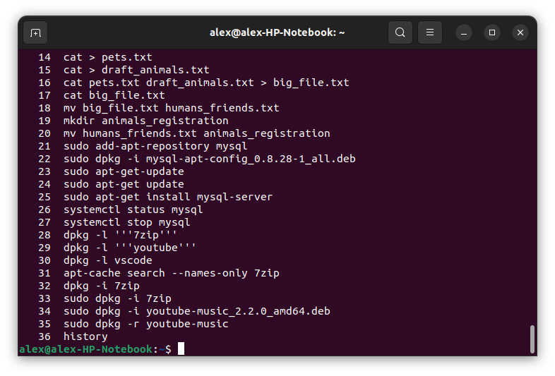
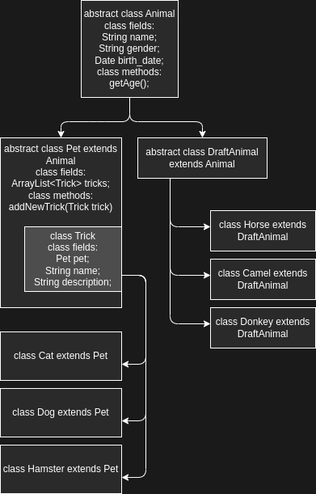
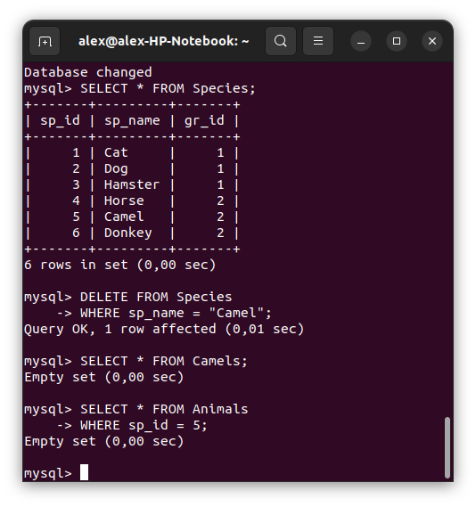
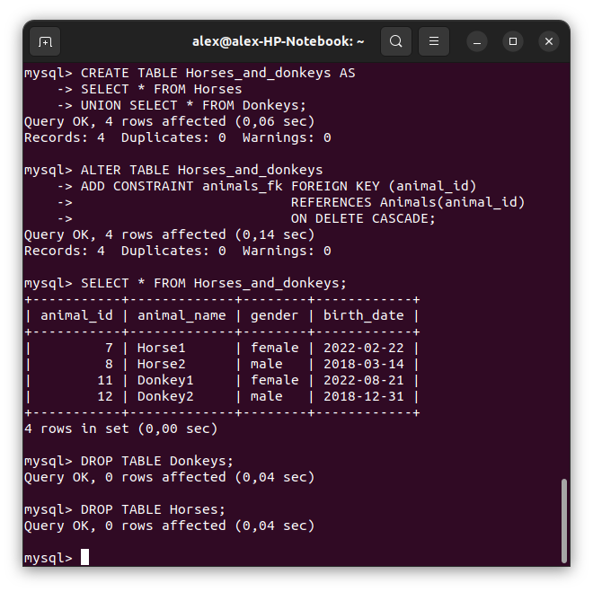
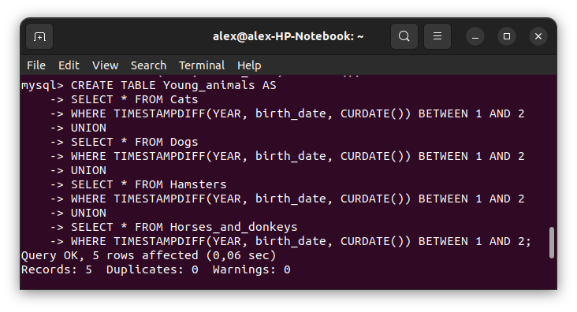
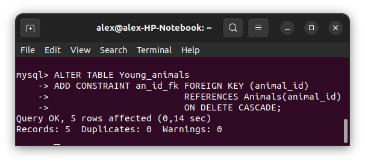
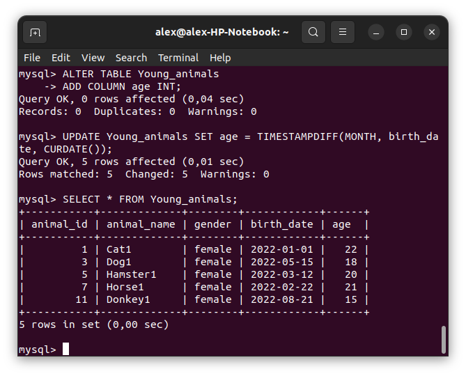
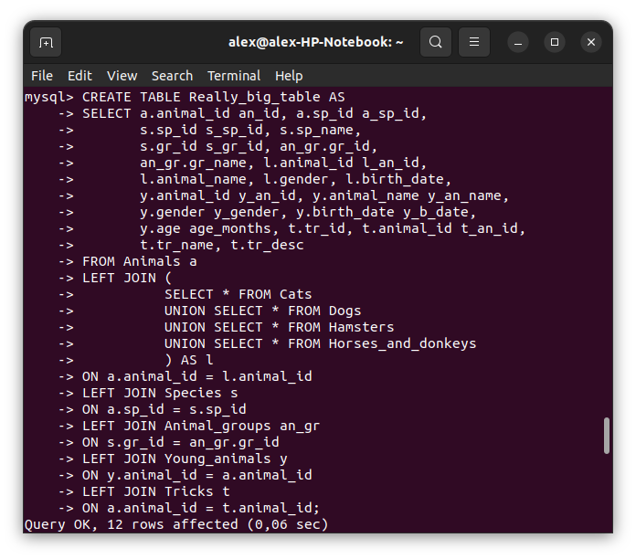

## Информация о проекте

---

&nbsp;&nbsp;&nbsp;&nbsp;В данном проекте содержится программа, имитирующая работу 
реестра домашних животных, dump-файлы базы данных, 
соответствующие состоянию последней до и после 
исполнения операций, описанных в заданиях 10-12, 
а также классовая диаграмма, описывающая 
взаимосвязь между классами, содержащимися в пакете
species.

### Содержание:
* [Задания 1 - 5](#задания-1---5)
* [Задание 6](#задание-6)

### Задания 1 - 5:
\
&nbsp;&nbsp;&nbsp;&nbsp;В истории команд содержатся несколько лишних записей,
как следствие моих ошибок
---
### Задание 6:
\
&nbsp;&nbsp;&nbsp;&nbsp;Я принял решение не давать вьючным животным возможность 
обучаться трюкам, поскольку в таком случае классы отличались бы
только своим названием
---
### Задания 7-9:
&nbsp;&nbsp;&nbsp;&nbsp;Инициализация и заполнение таблиц базы данных 
Humans_friends представленны в виде
[dump-файла](MySQL_db_init/7_8_9.sql)
---
### Задание 10:
>Удалив из таблицы верблюдов, т.к. верблюдов решили перевезти в другой
питомник на зимовку. Объединить таблицы лошади, и ослы в одну таблицу.

*
*
---
### Задание 11:
>Создать новую таблицу “молодые животные” в которую попадут все
животные старше 1 года, но младше 3 лет и в отдельном столбце с точностью
до месяца подсчитать возраст животных в новой таблице

*
*
*
---
### Задание 12:
>Объединить все таблицы в одну, при этом сохраняя поля, указывающие на
прошлую принадлежность к старым таблицам.

*
*
---
### Задание 13:
>Создать класс с Инкапсуляцией методов и наследованием по диаграмме.

&nbsp;&nbsp;&nbsp;&nbsp;Класс Animal, его наследники Pet и Draft и 
их наследники Cat, Dog, Hamster, Horse, Camel,
Donkey содержатся в пакете 
[species.](src/species)
---
### Задание 14:
>Написать программу, имитирующую работу реестра домашних животных
>В программе должен быть реализован следующий функционал:\
> 
> 
>14.1 Завести новое животное\
>14.2 определять животное в правильный класс\
>14.3 увидеть список команд, которое выполняет животное\
>14.4 обучить животное новым командам\
>14.5 Реализовать навигацию по меню

&nbsp;&nbsp;&nbsp;&nbsp;[Программа](src/Main.java) использует пакеты 
app, species, tools.\
&nbsp;&nbsp;&nbsp;&nbsp;Пакет [app](src/app) содержит единственный 
класс SimplifiedApp, заменивший ранее начатый и 
удалённый класс App. Данный класс содержит
реализацию страниц меню.\
&nbsp;&nbsp;&nbsp;&nbsp;
Пакет [tools](src/tools) содержит инструменты 
для взаимодействия с пользователем, смены вида
животного и счётчик Counter.
---
### Задание 15:
>Создайте класс Счетчик, у которого есть метод add(), увеличивающий̆
значение внутренней̆ int переменной̆ на 1 при нажатие “Завести новое
животное” Сделайте так, чтобы с объектом такого типа можно было работать в
блоке try-with-resources. Нужно бросить исключение, если работа с объектом
типа счетчик была не в ресурсном try и/или ресурс остался открыт. Значение
считать в ресурсе try, если при заведения животного заполнены все поля.

&nbsp;&nbsp;&nbsp;&nbsp;
Класс [Counter](src/tools/Counter.java) 
имплементирует интерфейс AutoCloseable 
в файле [.idea/inspectionProfiles/Project_Default.xml](.idea/inspectionProfiles/Project_Default.xml) 
добавлено ограничение, запрещающее работу 
с этим классом вне блока try-with-resources.\
&nbsp;&nbsp;&nbsp;&nbsp;Если операция 
добавления нового животного была прервана, 
переопределённый метод close() бросит исключение 
Counter.AnimalAdditionInterrupted

